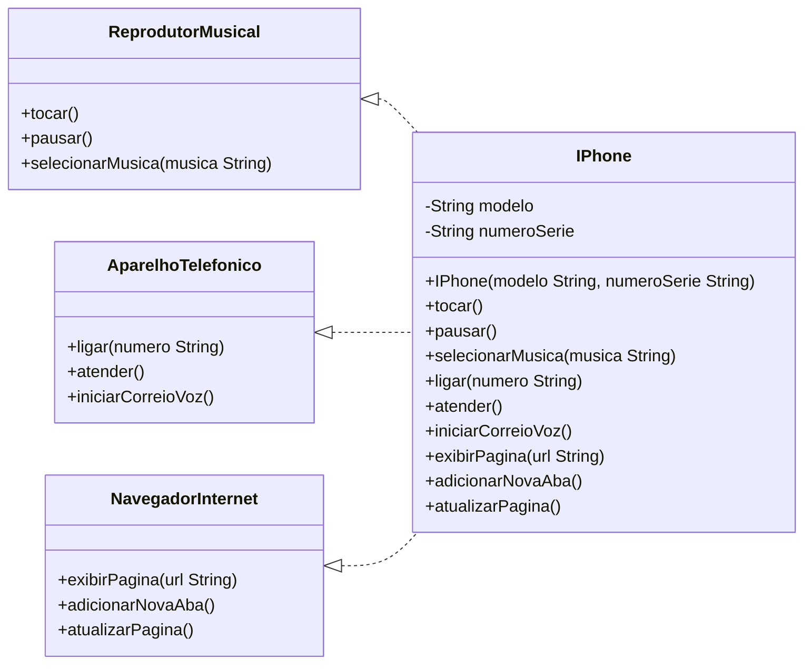

```mermaid
classDiagram
    direction LR

    class ReprodutorMusical {
      +tocar()
      +pausar()
      +selecionarMusica(musica String)
    }

    class AparelhoTelefonico {
      +ligar(numero String)
      +atender()
      +iniciarCorreioVoz()
    }

    class NavegadorInternet {
      +exibirPagina(url String)
      +adicionarNovaAba()
      +atualizarPagina()
    }

    class IPhone {
      -String modelo
      -String numeroSerie
      +IPhone(modelo String, numeroSerie String)
      +tocar()
      +pausar()
      +selecionarMusica(musica String)
      +ligar(numero String)
      +atender()
      +iniciarCorreioVoz()
      +exibirPagina(url String)
      +adicionarNovaAba()
      +atualizarPagina()
    }

    ReprodutorMusical <|.. IPhone
    AparelhoTelefonico <|.. IPhone
    NavegadorInternet <|.. IPhone
```
